# 🐳 Docker: Web Application Deployment

Welcome to the Docker repository demonstrating web application deployment using containerization technology. This repository provides a seamless and reproducible environment for deploying the following components:

## 🌐 Web Services
- 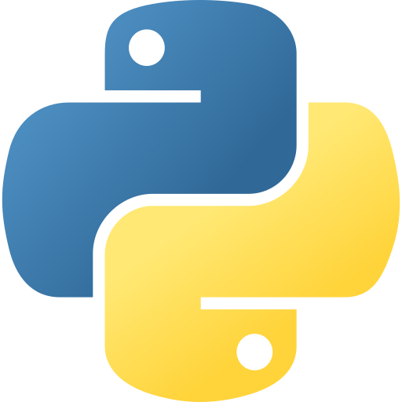 Python with Flask: A lightweight and flexible web framework for building Python-based web services. 
- 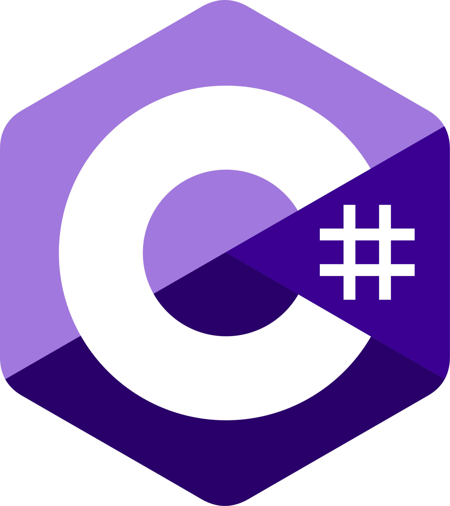 C# with ASP.NET: A powerful web framework for developing C# web services with robust capabilities.

## 🌐📱 Web Apps
-  Python with Flask: Create dynamic and interactive Python-based web applications using Flask.
- 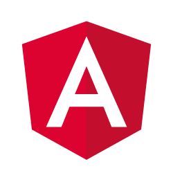 Angular: Build modern and feature-rich frontend applications with this framework.

## 🗄️ Database
- 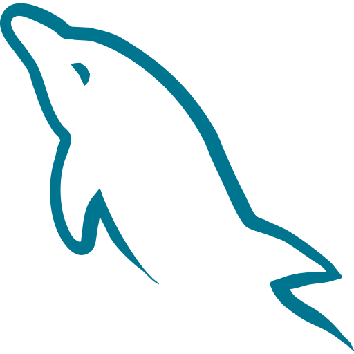 MySQL: A widely-used relational database management system for storing data used by web applications.

## ⚙️ Execution Environments
- 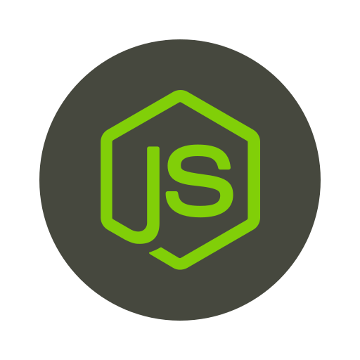 Node.js: A versatile and popular JavaScript runtime environment, facilitating server-side scripting for web applications.

## 💻 Programming Languages
-  Python: A high-level and versatile programming language for web development and various other applications.
-  C#: A powerful and object-oriented language commonly used for building Windows applications and web services.
- 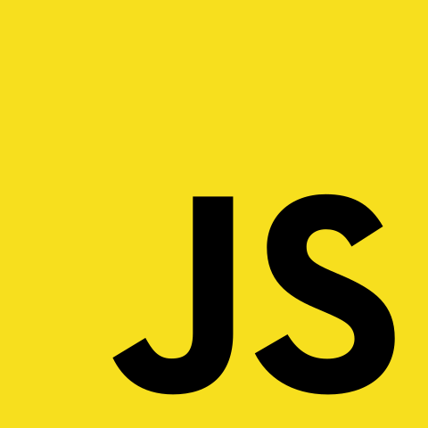 JavaScript: A widely-used scripting language for creating dynamic web content and enabling interactivity.
- 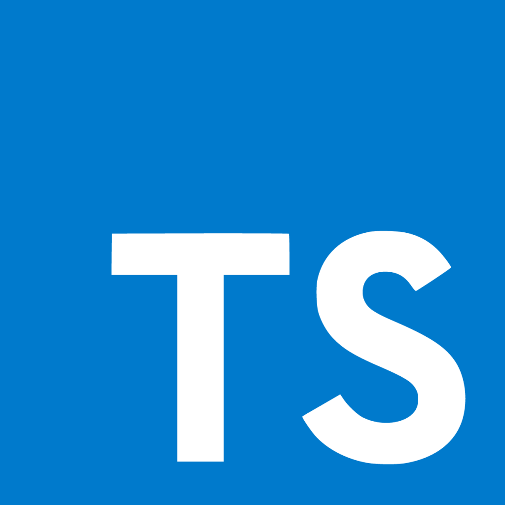 TypeScript: A superset of JavaScript that adds optional static typing, enhancing developer productivity and code quality.

## 🛠️ Frameworks & MicroFrameworks
-  Flask
- 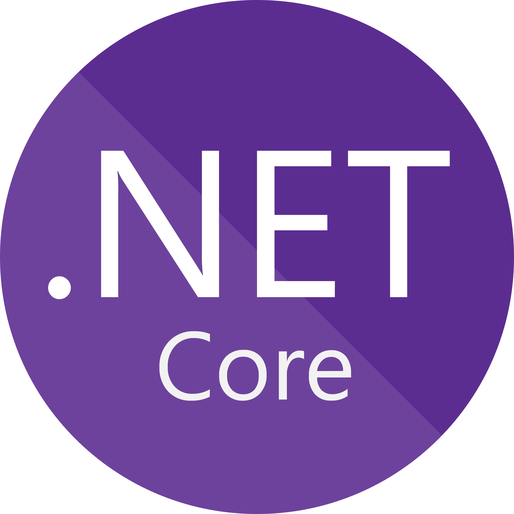 .NET
-  Angular

## 📄 Data File Formats
- 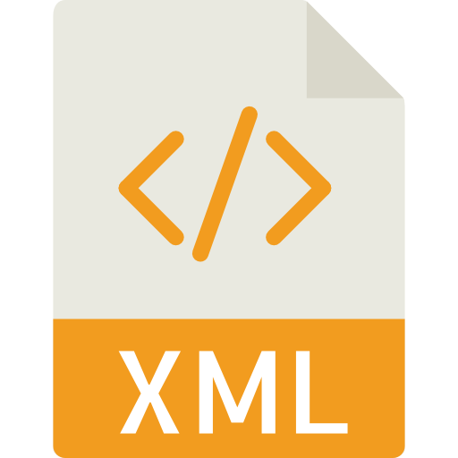 XAML: A declarative XML-based language primarily used for creating user interfaces in WPF applications.
- 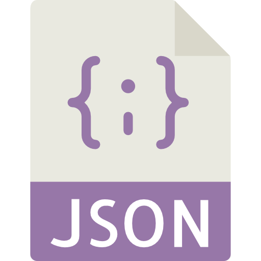 JSON: A lightweight and human-readable data interchange format, commonly used for API communication and configuration.
- 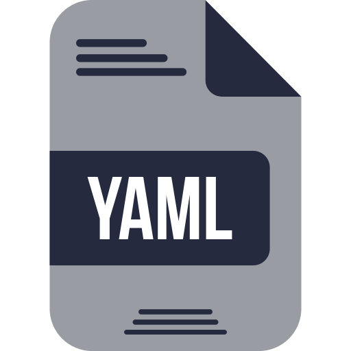 YAML: A human-readable data serialization format, often utilized for configuration files and data exchange between systems.

## 🖥️ Supported Operating Systems
- 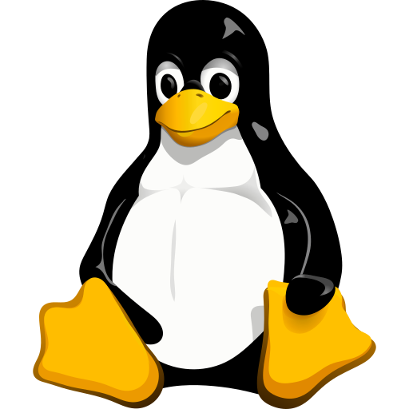 Linux: The repository supports various Linux distributions, including Ubuntu, CentOS, and Debian, for hosting the Docker containers and running the web applications.

By utilizing Docker and containerization, this project ensures easy setup and deployment, allowing developers to focus on building robust web applications without worrying about the complexities of environment configuration.

Feel free to explore the provided code and Docker configurations to better understand how these technologies work together to streamline the deployment process for web applications. If you have any questions or feedback, don't hesitate to reach out and contribute to this open-source project!